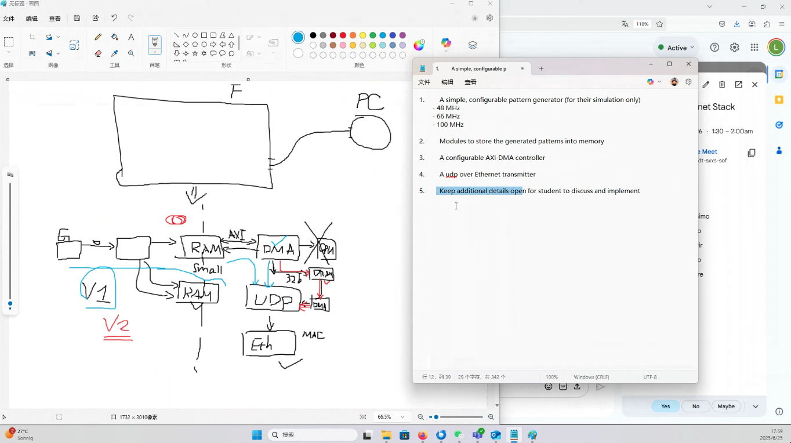

# Meeting Notes
## 05/XX/25
- 4900 - 4 credits
- Get work done as early as possible
- 12 hours a week for senior project
- Projects have gone bad often due to saving up work
- Technical activities
- Brain computer interface
- Aquire signal of neurons
- Mesaure analog signals from brain
- Digitize and send
- Blackrock neruotech
- Over ethernet to computer that will save data and visualize
- Udp protocol is used to send
- Fpgas recieiving the data and saving into rams
- Cpu will be in charge of running ethernet stack and sockets and reading the data and sending through ethernet
- Cpu memcopys some data somewhere from fpga into dram then sent to kernel of cpu and shipped into the socket
- More data means memory limitations quickly
- You will saturate the dma's of dram
- Also saturate cpu and kernel
- This firmware will be provided
- This project aims to remove the cpu from the equation
- Put Ethernet upd stack inside the fpga
- Zync scale+ is the fpga.
- There is a dev kit in the lab
- Can be  on simpler fpga boards
- Fpga will have mac controller that can implement as an ip
- First stack will be to take fpga from zylinx to take packet.
- Meet with Lewan every 2 weeks
- Come up with a bloack diagram of the system
- Start getting hands dirty with fpga board - making led blink - installing some ethernet
- Up to us to self organize
- Mid july to august liyuan wont be available in person (wont be in US)
- Zynx 7000 boards somewhere
- Lab SMBB 1st floor *Pierre's lab
- Send UID to liyuan for access

## 06/13/25

### Wednesday - 18:00PM - Biweekly agreement (For now)

### Tasks:
	- Getting access to FPGA's 
	- Blink an LED
	- Git and Github create a repo
	- README to record our biweekly meeting (meeting record)
	- Take a look at the UDP protocol
	- Understand how Ethernet works with UDP
	- Vivado - Get familiar with and potentially install(?)
	- Vivado - Have to use vivado for new series Zylinx FPGA
	- Modelsim is in Vivado already
	- UDP - Get a broad overview
	- UDP - Start analyzing in hardware
	- UDP - Reference datasheet
	- Emulator for protocol
		○ Reading and writing behavior
		○ what is the waveform
	- DMA - DMA will help us remove the CPU
	- Understand DMA

### Formatted Tasks
	- We want to get familiarity with the FPGA board but we are waiting on Liyuan before we can do this
	- (Ian) - Create Github Repo and assign a Markdown file to track meeting notes
	- We currently plan on meeting Bi-weekly with Liyuan
		○ For the 3 of us senior bachelor's we will likely meet more but that is TBD
	- Get familiar with UDP and how it contributes to the Ethernet stack
	- Get familiar with how DMA will help us
		○ what is it?
		○ why will it help us?
  	- Get familiar with Vivado(?) (Wait for Liyuan on this for now)
	
### Outstanding Tasks for Liyuan
	- Get us access to labs
	- Check if we are actually using Vivado

### Liyuan's Role
Take questions to Liyuan (clarified that he wants to be hands off for his role and he is busy so don't treat him as another group member but as someone we can take clarifying questions to

## 06/25/25

### TODO:
- Keep learning about UDP, DMA, Vivado, and FPGA.
- We will meet Wednesday to task out learnings and brainstorm approaches to tasks
- All sync and make sure we understand Liyuan's description of the project

### Questions we had answered
- How do we get access to Vivado?
  - Machine in lab will have it installed
  - Maybe [this link](https://adaptivesupport.amd.com/s/question/0D52E00006hpaP5SAI/to-download-vivado-for-students-for-educational-purpose?language=en_US)
  - Maybe software center?
- Do we only have access to one FPGA?
  - Yes, unless Liyuan gets us more or we buy one
- Remote access?
  - No, SSH is not a good way of approaching this.
  
### Outstanding tasks
- Still outstanding on lab access
- Liyuan is trying to get FPGA boards we can mess around with in the lab
- Reach out to John Davis to understand better the Senior Project classes and requirements (Ian)
  - What are our deadlines?
  - What do our senior classes look like
  - Do we need to write a thesis for our senior project?

### General notes and information

- Top portion shows FPGA with connection to PC
- Bottom portion is what will be implemented on FPGA board
  - G is a configurable signal generator that we can use to emulate data for our project
    - we should implement this to be configurable for the frequencies of:
      - 48MHz
      - 66MHz
      - 100MHz
- There are two versions we could implement (Or we could even make our own additions)
  - V1:
    - Just one RAM and one DMA between data and UDP
  - V2:
    - Multiple RAM so we can get data and start DMA without bottlenecking RAM and DMA (writing data from generator and DMA ops would be parallel)
    - Multiple DMA
      - One DMA to read from RAM, which would then output to DRAM, then a DMA to read from that DRAM and send to the UDP hardware stack

## 07/01/25

### TODO by next Wednesday:
- Someone install vivado
- Still get an understanding of UDP, Vivado, and DMA. (Next Wednesday, have a solid understanding of these 3)
- UDP
	- Understand how packets are formed and what they look like
		- Headers?
- DMA
	- Understand what it does.
	- What it's for.
	- How it's implemented and used on a typical FPGA board.
- Vivado
	- Can we get it on our machine
		- If someone does get it on their machine, how do we create a project and start developing?
- Reach out to John Davis (Ian)

### Questions:
- Is 2+ RAM done in software or hardware?
- What was the DRAM for in between the DMA's?

### down the line
- specific connector for ethernet
	- RJ45?
	- Fiber optic?

## 07/10/25

### Tasks:
- Ian to try and get a response from John Davies about senior class structure (John hasn't responded)

### Notes: 
- Next two meetings Liyuan is in Germany (8 hour time difference)
	- Next two Bi-Weekly meetings with Liyuan will be 
		- July 23rd @ 4PM
		- August 7th @ 4PM
- Since next week is Liyuan's last week here we will meet next Thursday (July 17th) @ 5:30PM In-Person at the Lab to have him show us what we have access to and get hands on Vivado
- Vivado 2020.1 is more compatible with our board, but if we use another version that is not the end of the world right now
	- Second option is 2022.1 (Liyuan's second preference)

### Questions:
	- Is DMA something that is provided for us?
	- What board are we using?